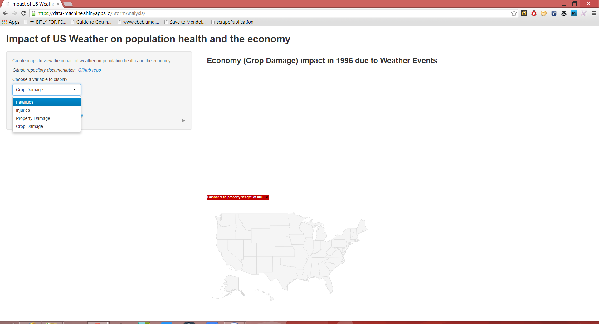
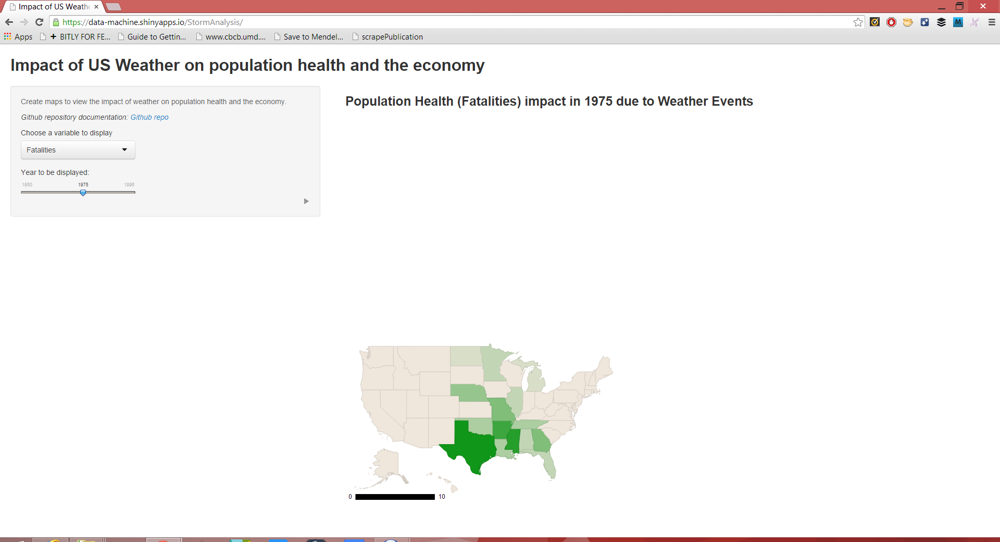

#StormAnalysis
## The app
- User can select a type of report
  - Fatalities, this is a report on the total number of fatal accidents
  - Injuries, this is a report on the total number of injuries that occured because of the weather
  - Property Damage, this is a report on the cost due to damages to property
  - Crop Damage, this is a report on the cost due to damages to crop
- User an select the a Year to view the data from different reports
- The map can be annimated by selecting a year and clicking the play button

--- .class #id 

## The Reports

--- .class #id 

## Year Selection and Animation

--- .class #id 

## The app components

- Can be accessed from [here](https://data-machine.shinyapps.io/StormAnalysis/)
- The [googleVis](http://cran.r-project.org/web/packages/googleVis/) package was used to generate the GeoChart
